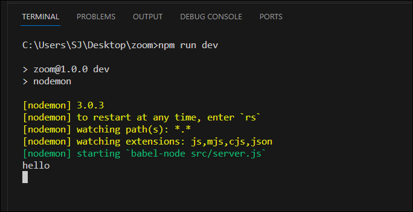
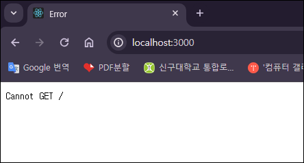
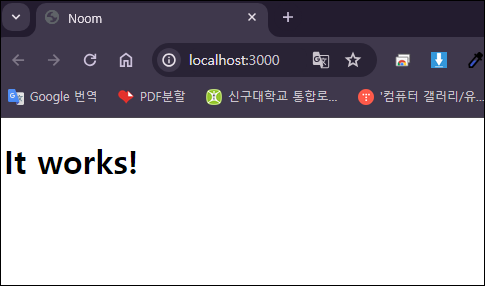

# 개발환경 구축

NodeJS, WebRTC, Websocket을 사용한 Zoom 클론.

> `Nodemon`  
> : 프로젝트를 살펴보고 변경 사항이 있을시 서버를 재시작해주는 프로그램  
> 이 프로젝트에서는 서버를 재시작하는 대신에 babel-node를 실행하도록 설정함
>
> `Babel`  
> : 우리가 작성한 코드를 일반 NodeJS 코드로 컴파일해준다.  
> src/server.js 파일에 해준다.
>
> `server.js`  
> 🔸 express를 import하고 express 어플리케이션을 구성한다.  
> 🔸 view engine을 Pug로 설정하고 views 디렉토리 설정  
> 🔸 public 디렉토리 설정(public - FrontEnd에서 구동되는 코드)  
> 🔸 views 디렉토리에 있는 home.pug 렌더  
>  (catchall url을 만들고 싶다면 app.get("/\*", (req, res) => res.redirect("/")); 기입 )

## Server Setup (일반적인 NodeJS프로젝트 만들기)

### 1. zoom 프로젝트 생성

> mkdir zoom  
> cd zoom

### 2. `package.json` 생성

> npm init -y

### 3. VS Code 실행

> code .

### 4. `package.json` 수정

- scripts, main, keyword, author 삭제
- license에 "MIT" 수정
- description에 "Zoom Clone using NodeJS, WebRTC and Websockets." 기입

```json
{
  "name": "zoom",
  "version": "1.0.0",
  "description": "Zoom Clone using NodeJS, WebRTC and Websockets.",
  "license": "MIT"
}
```

### 5. `README.md` 파일 생성

> echo # Noom >> README.md

### 6. Nodemon 설치

> npm i nodemon -D

- zoom폴더에 nodemon.json 파일 생성
- zoom폴더에 babel.config.json 파일 생성

### 7. 서버 생성

- src폴더 생성
- src폴더에 server.js 파일 생성

### 8. 바벨 설치

> 설치 전 `git init .`  
> npm i @babel/core @babel/cli @babel/node @babel/preset-env -D

### 9. `.gitignore` 파일 생성

- `/node_modules` 기입  
  (node_modules 폴더는 GitHub에 업로드하지 않음)

### 10. `nodemon.json` 작성

- "exec" 명렁어 설정  
  ("exec" == server.js 실행)

```json
{
  "exec": "babel-node src/server.js"
}
```

### 11. `babel.config.json` 작성

- "presets" 설정

```json
{
  "presets": ["@babel/preset-env"]
}
```

### 12. `package.json` 작성

- "scripts" 설정

- "dev"는 nodemon을 호출  
  (nodemon이 호출되면 nodemon이 nodemon.json에 있는 코드실행)

```json
{
  "name": "zoom",
  "version": "1.0.0",
  "description": "Zoom Clone using NodeJS, WebRTC and Websockets.",
  "license": "MIT",
  "scripts": {
    "dev": "nodemon"
  },
  "devDependencies": {
    "@babel/cli": "^7.23.9",
    "@babel/core": "^7.23.9",
    "@babel/node": "^7.23.9",
    "@babel/preset-env": "^7.23.9",
    "nodemon": "^3.0.3"
  }
}
```

### 13. express 설치 후 import, express app 생성

> npm i express

- src > server.js에 express import

```javascript
import express from "express";

console.log("hello");
```

- express app 생성

```javascript
import express from "express";

const app = express();

console.log("hello");

// 포트 3000
app.listen(3000);
```

### 14. 실행

> npm run dev

- 아래 사진처럼 "hello" 가 출력되고 포트 3000 서버가 구동되고 있다.

<br>


## Frontend Setup

static files, 유저들에게 가게 될 파일들 만들기

### 1. src폴더에 public폴더 생성

- public폴더에 js폴더 생성 후 app.js 파일 생성

### 2. pug 설치 및 설정

> npm i pug

- 추후 pug 페이지들을 렌더하기 위해 server.js에 설정
- src폴더에 views폴더 생성 후 home.pug 파일 생성

```javascript
import express from "express";

const app = express();

// 확장자 지정
app.set("view engine", "pug");
// 폴더 경로 지정
app.set("views", __dirname + "/views");
// => 해당 폴더에서 확장자가 pug인걸 고르겠다는 의미

const handleListen = () => console.log(`Listening on http://localhost:3000`);
// 포트 3000
app.listen(3000, handleListen);
```

### 3. route 생성

```javascript
import express from "express";

const app = express();

// 확장자 지정
app.set("view engine", "pug");
// 폴더 경로 지정
app.set("views", __dirname + "/views");
// => 해당 폴더에서 확장자가 pug인걸 고르겠다는 의미

// home으로 가면 request, response를 받고 res.render(home으로 렌더)
app.get("/", (req, res) => res.render("home"));

const handleListen = () => console.log(`Listening on http://localhost:3000`);
// 포트 3000
app.listen(3000, handleListen);
```



### 4. `home.pug`에 script 추가

- home.pug에 app.js 연결

```javascript
doctype html
html(lang="en")
  head
    meta(charset="UTF-8")
    meta(name="viewport", content="width=device-width, initial-scale=1.0")
    title Noom
  body
    h1 It works!
    script(src="/public/js/app.js")
```

### 5. static 작업

- server.js 에 public 연결

```javascript
import express from "express";

const app = express();

// 확장자 지정
app.set("view engine", "pug");
// 폴더 경로 지정
app.set("views", __dirname + "/views");
// => 해당 폴더에서 확장자가 pug인걸 고르겠다는 의미

app.use("/public", express.static(__dirname + "/public"));

// home으로 가면 request, response를 받고 res.render(home으로 렌더)
app.get("/", (req, res) => res.render("home"));

const handleListen = () => console.log(`Listening on http://localhost:3000`);
// 포트 3000
app.listen(3000, handleListen);
```

### 6. FrontEnd 자바스크립트 수정시 nodemon 새로고침 막기

- `nodemon.json`에 ignore 추가
- src/public 폴더 와 그안에 있는 모든것들을 무시

```json
{
  "ignore": ["src/public/*"]
}
```

### 7. `home.pug`에 MVP CSS 연결

> MVP CSS  
> : 기본적인 HTML 태그를 있는 그대로 꾸며준다.  
> ❓부트스트랩과 다른점❓  
> 부트스트랩은 class명을 써줘야되지만 mvp는 HTML태그만으로 스타일이 적용되어있다.  
> [사용법] CSS 링크를 header에 추가해주면 된다.  
> [링크] <https://andybrewer.github.io/mvp/>

```javascript
doctype html
html(lang="en")
  head
    meta(charset="UTF-8")
    meta(name="viewport", content="width=device-width, initial-scale=1.0")
    title Noom
    // MVP CSS
    link(rel="stylesheet", href="https://unpkg.com/mvp.css")
  body
    header
      h1 Noom
    main
      h2 Welcome to Noom
    script(src="/public/js/app.js")
```
