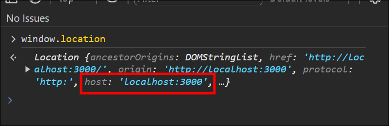
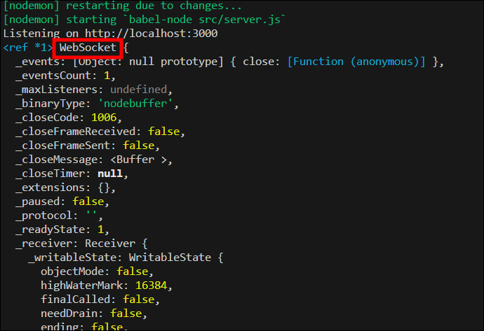
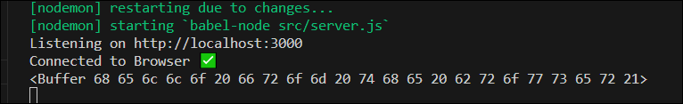
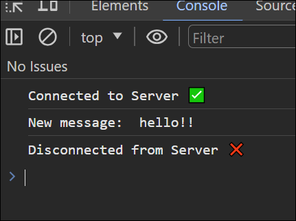
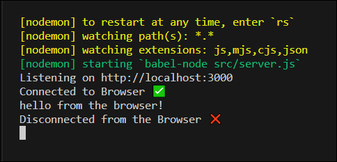

# HTTP vs WebSockets


> ### HTTP (HyperText Transfer Protocol)
>
> 🔸 클라이언트인 웹브라우저와 웹 서버가 서로 간 소통하기 위한 프로토콜이다.  
> 🔸 클라이언트에서 서버로 Request를 보내면 서버는 클라이언트로 Response를 보내는 방식으로 동작한다.  
> 🔸 Response가 있기 전에 무조건 Request가 있어야한다.  
> 🔸 기본적으로 무상태(Stateless)이므로 상태를 저장하지 않는다.  
> &nbsp;&nbsp;&nbsp;&nbsp; (request와 response과정 뒤에 클라이언트에 대한 정보가 남아있지 않기 때문에 기억하지 못한다.)
>
> ### WebSocket
>
> 🔸 하나의 TCP접속에 전이중 통신 채널을 제공하는 컴퓨터 통신 프로토콜이다.  
> 🔸 Socket Connection을 유지한 채로 실시간으로 양방향 통신 혹은 데이터 전송이 가능한 프로토콜이다.  
> 🔸 양방향 통신으로 연결이 이루어지면 클라이언트가 요청하지 않아도 데이터가 저절로 서버로부터 올 수 있다.  
> &nbsp;&nbsp;&nbsp;&nbsp; (즉 HTTP처럼 별도의 요청을 보내지 않아도 데이터를 수신할 수 있다.)  
> 🔸 채팅 어플리케이션, SNS, 구글Docs, LOL 같은 멀티플레이 게임, 화상회의 등에서 사용되고 있다.  
> 🔸 브라우저에 내장된 webSocket API 사용

### WebSocket이 왜 필요한가?

HTTP 만으로 페이스북 메세지를 구현한다면 주기적으로 서버에 request를 보내서 메세지가 왔는지 체크해야 된다.

# node.js로 WebSocket서버 만들기

> ## WebSockets 라이브러리 ws
>
> ### `ws`
>
> node.js에서 webSocket을 사용하기 편리하도록 해주는 라이브러리로, webSocket protocol을 실행(implement)하는 패키지라고 생각하면 된다.
>
> - ws는 webSocket의 코어, 중심 기능이지만 부가적인 기능을 제공해주진 않는다.
> - ws를 활용해서 실시간 채팅방 기능을 제공하는 프레임워크는 따로 존재한다.
>
> #### ws 설치
>
> `npm i ws`
>
> [ 공식문서 - WebSocket ](https://developer.mozilla.org/ko/docs/Web/API/WebSocket)  
> [ 공식문서 - ws ](https://www.npmjs.com/package/ws)  
> &nbsp;

- 현재 server.js 에는 express 프레임워크를 사용해서 http 프로토콜을 사용한 서버설정이 되어있는데,  
  webSocket을 이용해서 서버를 연결하기 위해 두 프로토콜을 합쳐줘야한다.  
  ※ 꼭 http서버와 ws서버를 같이 사용 안해도 된다. http서버를 원하지 않으면 ws서버만 사용해도 된다.

```javascript
import http from "http";
import WebSocket from "ws";
import express from "express";

const app = express();

app.set("view engine", "pug");
app.set("views", __dirname + "/views");
app.use("/public", express.static(__dirname + "/public"));
app.get("/", (_, res) => res.render("home"));
app.get("/*", (_, res) => res.redirect("/"));

// http 서버
const server = http.createServer(app);
// ws 서버
const wss = new WebSocket.Server({ server });

const handleListen = () => console.log(`Listening on http://localhost:3000`);
server.listen(3000, handleListen);
```

# WebSocket Events

webSocket은 JS의 addEventListener 메소드에서 click, submit 등 이벤트에 대해 두번째 인자로 콜백함수를 전달하고,  
해당 이벤트가 발생할 경우 함수를 실행시키는 방식과 유사하게 동작한다.

- 웹 소켓 서버(server.js)에 클라이언트 연결(connection)
- 연결된 소켓에 대한 정보가 `socket` 인자를 통해 전달된다.

```javascript
wss.on("connection", (socket) => {
  console.log(socket);
});
```

- 클라이언트(app.js)에서 서버와 연결(connection) 생성

> ### `window.location`
>
> 

<br>

```javascript
const socket = new WebSocket(`ws://${window.location.host}`);
```

<p align="center">
  
</p>

# WebSocket Messages

- app.js 에서 `open`, `message`, `close` 이벤트에 대한 이벤트 리스너 생성
- 10초 후 서버로 "hello from the browser!" 메세지 전송

```javascript
const socket = new WebSocket(`ws://${window.location.host}`);

// 서버와 연결 되었을때 발생
socket.addEventListener("open", () => {
  console.log("Connected to Server ✅");
});

// 서버로부터 메세지를 받을때 발생
socket.addEventListener("message", (message) => {
  console.log("New message: ", message.data);
});

// 서버로부터 연결이 끊겼을때 발생
socket.addEventListener("close", () => {
  console.log("Disconnected from Server ❌");
});

// 서버에 "hello from the browser!" 메세지 보냄
setTimeout(() => {
  socket.send("hello from the browser!");
}, 10000);
```

- server.js 에서 클라이언트 `open`, `message`, `close` 이벤트 받기
- 클라이언트로 "hello!!" 메세지 전송

> ⚠️ 강의에선 `message.toString( )` 로 메시지를 변환하는 과정 없이 코드가 작성되었지만, 이후 웹 소켓 버전이 바뀌면서 메시지를 toString으로 변환해서 사용해야 문자열이 똑바로 출력된다.
>
> 

<br>

```javascript
wss.on("connection", (socket) => {
  console.log("Connected to Browser ✅");

  // 브라우저 창을 닫으면 발생
  socket.on("close", () => {
    console.log("Disconnected from the Browser ❌");
  });

  // 브라우저로부터 메세지를 받을때 발생
  socket.on("message", (message) => {
    console.log(message.toString());
  });

  // 브라우저에 "hello!!" 메세지 보냄
  socket.send("hello!!");
});
```

> ## 결과
>
> 🟢 서버를 켜놓고, 브라우저에서 `localhost:3000` 에 접속하면, 브라우저 콘솔창에 서버에 연결되었다는 메세지와 서버에서 보낸 메세지가 출력  
> 🟢 서버와 연결이 끊어지면, 브라우저 콘솔창에 연결이 끊겼다는 메세지가 출력
>
> 
>
> 🟢 브라우저에서 `localhost:3000` 에 접속하면, 서버 콘솔창에 브라우저에 연결되었다는 메세지와 10초 후 브라우저에서 보낸 메세지가 출력  
> 🟢 브라우저와 연결이 끊어지면, 서버 콘솔창에 연결이 끊겼다는 메세지가 출력
>
> 
