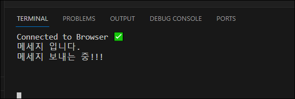
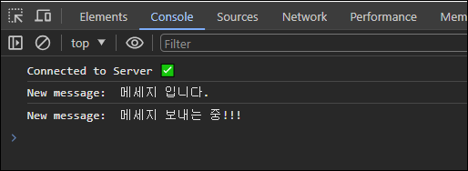
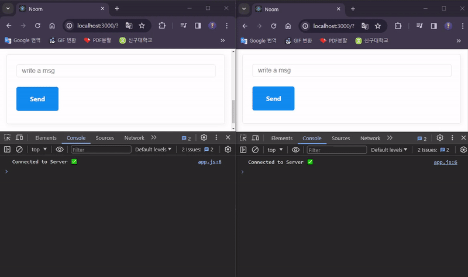
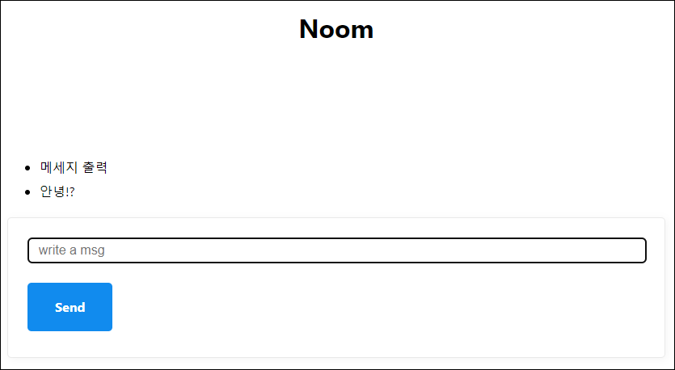
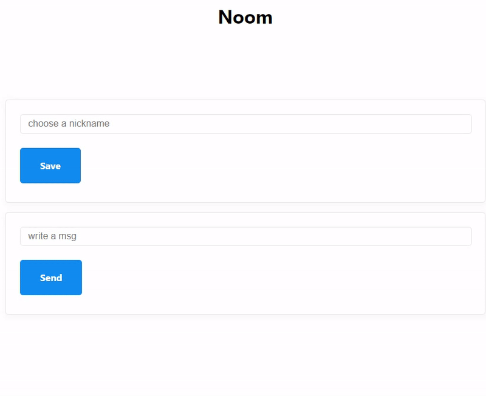
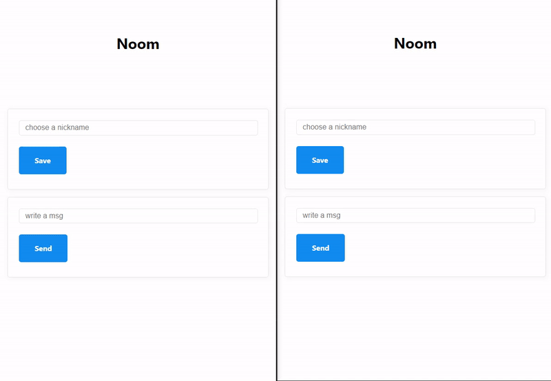

# WebSocket으로 채팅 만들기

### 1. 웹소켓을 통해 클라이언트와 서버 연결

- `home.js` 에 메세지 입력할 input과 button 생성

```javascript
doctype html
html(lang="en")
  head
    meta(charset="UTF-8")
    meta(name="viewport", content="width=device-width, initial-scale=1.0")
    title Noom
    link(rel="stylesheet", href="https://unpkg.com/mvp.css")
  body
    header
      h1 Noom
    main
      ul
      form#message
        input(type="text", placeholder="write a msg", required)
        button Send
    script(src="/public/js/app.js")
```

- `app.js` 에 메세지 form event Listener
- 소켓이 메세지를 받으면 콘솔창에 `message.data` 값을 출력

```javascript
const messageList = document.querySelector("ul");
const messageForm = document.querySelector("#message");
const socket = new WebSocket(`ws://${window.location.host}`);

socket.addEventListener("open", () => {
  console.log("Connected to Server ✅");
});

socket.addEventListener("message", (message) => {
  console.log("New message: ", message.data);
});

socket.addEventListener("close", () => {
  console.log("Disconnected from Server ❌");
});

messageForm.addEventListener("submit", (event) => {
  event.preventDefault();
  const input = messageForm.querySelector("input");
  socket.send(input.value);
  input.value = "";
});
```

- `server.js` 에 user가 보낸 메세지를 프론트 단의 소켓으로 전송

```javascript
wss.on("connection", (socket) => {
  console.log("Connected to Browser ✅");

  socket.on("close", () => {
    console.log("Disconnected from the Browser ❌");
  });

  socket.on("message", (message) => {
    socket.send(message.toString());
  });
});
```

<p align="center">
  
  
</p>

> ### 🤔 크롬에서 두개의 탭을 열어 `localhost:3000` 애 접속을 한후, 둘 중 하나의 폼에 메세지를 입력하고 서버에 전송하면?
>
> 메세지를 전송한 탭의 콘솔에서만 메세지가 출력된다.  
> 즉, 하나의 탭(클라이언트)은 각자 서버와 연결을 맺게 되고, 클라이언트 간에 메세지는 주고 받을 수 없는 상태라는 것을 의미한다.  
> &nbsp;

### 2. 서버에 연결된 사용자(클라이언트) 정보 저장하기

- 서버에 연결된 클라이언트 정보를 저장하기 위해 `server.js` 에 가상의 데이터베이스(`sockets`) 생성
- 누군가 서버에 연결하면 연결 정보를 "sockets"에 저장
- 서버가 어떤 클라이언트로부터 메세지를 받으면 현재 서버에 연결된 모든 클라이언트에 해당 메세지를 전송  
  (=> 클라이언트끼리 서로의 메세지를 확인할 수 있다.)

```javascript
const sockets = [];

wss.on("connection", (socket) => {
  sockets.push(socket);
  console.log("Connected to Browser ✅");

  socket.on("close", () => {
    console.log("Disconnected from the Browser ❌");
  });

  socket.on("message", (message) => {
    sockets.forEach((aSocket) => aSocket.send(message.toString()));
  });
});
```

<p align="center">
  
</p>

### 3. 보낸 메세지 화면에 출력하기

```javascript
const messageList = document.querySelector("ul");
const messageForm = document.querySelector("#message");
const socket = new WebSocket(`ws://${window.location.host}`);

...

socket.addEventListener("message", (message) => {
  console.log("New message: ", message.data);
  const li = document.createElement("li");
  li.innerText = message.data;
  messageList.appendChild(li);
});
```

<p align="center">
  
</p>

### 4. 닉네임으로 사용자 구분하기

- `home.js` 에 닉네임 입력할 input과 button 생성

```javascript
doctype html
html(lang="en")
  head
    meta(charset="UTF-8")
    meta(name="viewport", content="width=device-width, initial-scale=1.0")
    title Noom
    link(rel="stylesheet", href="https://unpkg.com/mvp.css")
  body
    header
      h1 Noom
    main
      form#nick
          input(type="text", placeholder="choose a nickname", required)
          button Save
      ul
      form#message
        input(type="text", placeholder="write a msg", required)
        button Send
    script(src="/public/js/app.js")
```

- `app.js` 에 닉네임 form event Listener

```javascript
const messageList = document.querySelector("ul");
const messageForm = document.querySelector("#message");
const nickForm = document.querySelector("#nick");
const socket = new WebSocket(`ws://${window.location.host}`);

socket.addEventListener("open", () => {
  console.log("Connected to Server ✅");
});

socket.addEventListener("message", (message) => {
  console.log("New message: ", message.data);
  const li = document.createElement("li");
  li.innerText = message.data;
  messageList.appendChild(li);
});

socket.addEventListener("close", () => {
  console.log("Disconnected from Server ❌");
});

messageForm.addEventListener("submit", (event) => {
  event.preventDefault();
  const input = messageForm.querySelector("input");
  socket.send(input.value);
  input.value = "";
});

nickForm.addEventListener("submit", (event) => {
  event.preventDefault();
  const input = nickForm.querySelector("input");
  socket.send(input.value);
  input.value = "";
});
```

<p align="center">
  
</p>

### 🚨 문제발생

사용자가 닉네임을 입력해서 서버에 전송하면 서버는 닉네임인지 메세지인 구분을 못한다.  
왜냐하면 서버에서 메세지를 보낼때 모든 클라이언트에게 보내고 있기 때문이다.  
본인이 보낸 메세지와 상대방이 보낸 메세지를 구분하기 위해서도 필요하다.

### ✅ 해결방법

서버에 전송하는 폼을 단순 String 형식이 아니라 JSON객체 형식으로 변경한 후,  
`type` 속성을 객체에 담아서 각 메세지의 타입을 구분한다.

```json
// JSON
{
	type: 'new_message',
	payload: 'hello everyone!',
}
{
	type: 'nickname',
	payload: 'NinNiNanNa',
}
```

- `app.js` 에 서버로 보내는 메세지는 전부 객체에 담고, `JSON.stringify()` 메소드를 사용해 `String` 형식으로 서버에 전송  
  ❓ 왜 `String` 형식으로 변환해서 서버에 전송해야되나?  
  WebSocket API는 서버가 어떤 언어를 사용하는지 알 수 없고, 특정 언어에서만 API가 사용될 것이라고 단정 지을 수 없기 떄문에 `String` 형식의 데이터를 전송하고, 서버 측에서 필요에 따라 데이터 형식을 변환해서 사용해야한다.

```javascript
const messageList = document.querySelector("ul");
const messageForm = document.querySelector("#message");
const nickForm = document.querySelector("#nick");
const socket = new WebSocket(`ws://${window.location.host}`);

function makeMessage(type, payload) {
  // 메세지 type과 메시지 내용을 객체에 담기
  const msg = { type, payload };
  // JSON을 String으로 변환해서 return
  return JSON.stringify(msg);
}

...

messageForm.addEventListener("submit", (event) => {
  event.preventDefault();
  const input = messageForm.querySelector("input");
  socket.send(makeMessage("new_message", input.value));
  input.value = "";
});

nickForm.addEventListener("submit", (event) => {
  event.preventDefault();
  const input = nickForm.querySelector("input");
  socket.send(makeMessage("nickname", input.value));
  input.value = "";
});

```

<p align="center">
  
</p>

- `server.js` 에 클라이언트로부터 받은 `String` 형식의 메세지를 `JSON.parse()` 메소드를 사용해 다시 객체로 변환
- socket에 `nickname`이라는 새로운 item을 추가해서 어떤 닉네임을 가진 socket인지 알려준다. (닉네임을 적지 않았을 경우 "익명"인 경우도 고려)

```javascript
wss.on("connection", (socket) => {
  sockets.push(socket);
  // 익명
  socket["nickname"] = "Anon";
  console.log("Connected to Browser ✅");

  socket.on("close", () => {
    console.log("Disconnected from the Browser ❌");
  });

  socket.on("message", (msg) => {
    const message = JSON.parse(msg);
    switch (message.type) {
      case "new_message":
        sockets.forEach((aSocket) =>
          aSocket.send(`${socket.nickname}: ${message.payload.toString()}`)
        );
        break;
      case "nickname":
        socket["nickname"] = message.payload;
        break;
    }
  });
});
```

<p align="center">
  
</p>
