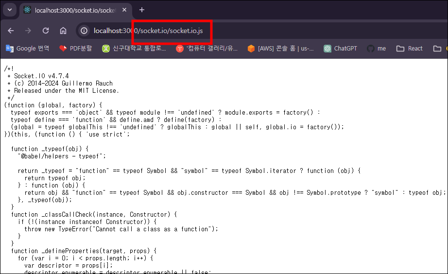
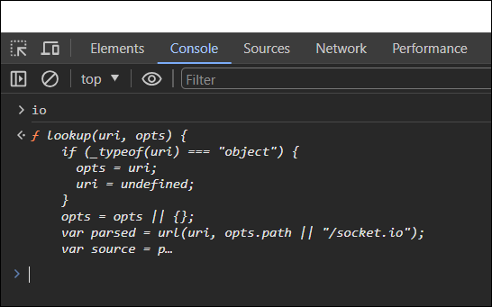
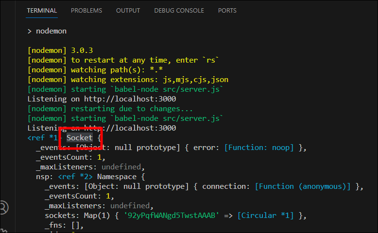
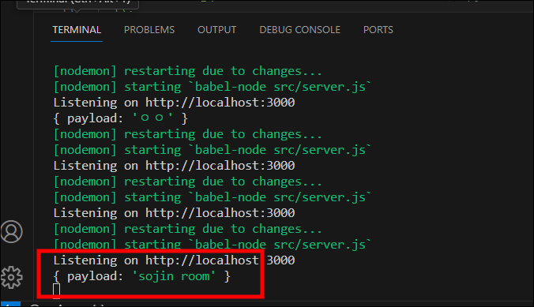
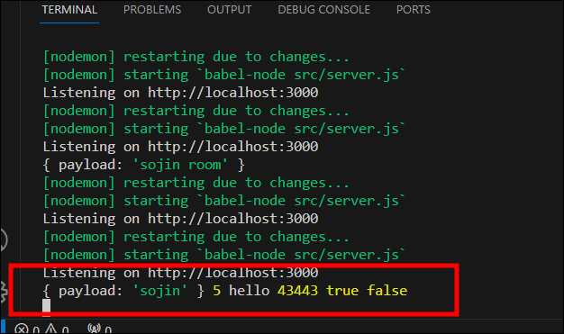
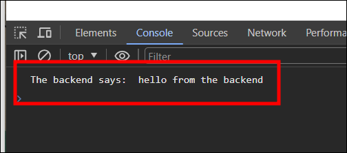

# SocketIO vs WebSockets

[ 공식문서 - socket.io ] <https://socket.io/docs/v4/#what-socketio-is-not>  
[ 참고문서 - socket.io npm ] <https://www.npmjs.com/package/socket.io>

#### WebSocket : 양방향 소통을 위한 프로토콜

#### socket.io : 양방향 통신을 하기 위해 웹소켓 기술을 활용하는 라이브러리

프로토콜? 서로 다른 컴퓨터끼리 소통하기 위한 약속  
※ WebSocket과 socket.io는 자바스크립트와 jQuery의 관계와 비슷한 것 같다.

> ### WebSocket
>
> - HTML5 웹 표준 기술
> - 매우 빠르게 작동하며 통신할때 아주 적은 데이터를 이용
> - 이벤트를 단순히 듣고, 보내는 것만 가능
>
> ### socket.io
>
> - 표준 기술이 아니며, 라이브러리
> - 소켓 연결 실패 시 fallback을 통해 다른 방식으로 알아서 해당 클라이언트와 연결을 시도
> - 방 개념을 이용해 일부 클라이언트에게만 데이터를 전송하는 브로드캐스팅(Broadcasting)이 가능  
>   &nbsp;

### 어떤걸 써야할까?

- 서버에서 연결된 소켓(사용자)들을 세밀하게 관리해야하는 서비스인 경우에는 Broadcasting 기능이 있는 socket.io를 쓰는게 유지보수 측면에서 휠씬 이점이 많다.
- 가상화폐 거래소 같이 데이터 전송이 많은 경우에는 빠르고 비용이 적은 표준 WebSocket을 이용하는게 바람직하다.
- socket.io로 구성된 서버에게 소켓 연결을 하기 위해서는 클라이언트측에서 반드시 `socket.io-client` 라이브러리를 이용해야한다.

# SocketIO 설치

#### `npm i socket.io`

- src > server.js에 socket.io import한 후 io서버 생성

  ```javascript
  import http from "http";
  import SocketIO from "socket.io";
  import express from "express";

  const app = express();

  app.set("view engine", "pug");
  app.set("views", __dirname + "/views");
  app.use("/public", express.static(__dirname + "/public"));
  app.get("/", (_, res) => res.render("home"));
  app.get("/*", (_, res) => res.redirect("/"));

  const httpServer = http.createServer(app);
  const wsServer = SocketIO(httpServer);

  const handleListen = () => console.log(`Listening on http://localhost:3000`);
  httpServer.listen(3000, handleListen);
  ```

- socket.io를 설치하면 URL(`/socket.io/socket.io.js`)을 제공해준다.

  

- WebSocket API는 브라우저(클라이언트)에 설치되어 있지만 socket.io는 설치되어 있지 않기때문에 URL을 src > views > home.pug에 import해준다.  
   (=> front-end와 back-end에 socket.io를 설치해줘야한다.)

  ```javascript
  doctype html
  html(lang="en")
  head
    meta(charset="UTF-8")
    meta(name="viewport", content="width=device-width, initial-scale=1.0")
    title Noom
    link(rel="stylesheet", href="https://unpkg.com/mvp.css")
  body
    header
      h1 Noom
    main
    //- socket.io 설치
    script(src="/socket.io/socket.io.js")
    script(src="/public/js/app.js")
  ```

# SocketIO 연결

### 서버(back-end)

- src > server.js에 socket.io 연결 (앞서 WebSocket(wws) 과 방식은 비슷하다.)

  ```javascript
  import http from "http";
  import SocketIO from "socket.io";
  import express from "express";

  const app = express();

  app.set("view engine", "pug");
  app.set("views", __dirname + "/views");
  app.use("/public", express.static(__dirname + "/public"));
  app.get("/", (_, res) => res.render("home"));
  app.get("/*", (_, res) => res.redirect("/"));

  const httpServer = http.createServer(app);
  const wsServer = SocketIO(httpServer);

  // socket.io 연결
  wsServer.on("connection", (socket) => {
    console.log(socket);
  });

  const handleListen = () => console.log(`Listening on http://localhost:3000`);
  httpServer.listen(3000, handleListen);
  ```

### 클라이언트(front-end)

- src > views > home.pug에 socket.io를 설치하면 화면 콘솔창에서 io라는 함수를 볼 수 있다.
- `io`는 자동적으로 back-end socket.io와 연결해주는 함수이다.

  

- src > public > js > app.js에 socket.io 연결
- Websocket처럼 port, ws를 쓸 필요없다.

  ```javascript
  const socket = io();
  ```

### 클라이언트에 socket.io를 연결하면 서버에서 찍은 로그가 콘솔창에 출력된다.



# SocketIO is Amazing

### 화면에 채팅방 개설할 폼 생성

- src > views > home.pug에 form 생성하기

  ```javascript
  doctype html
  html(lang="en")
    head
      meta(charset="UTF-8")
      meta(name="viewport", content="width=device-width, initial-scale=1.0")
      title Noom
      link(rel="stylesheet", href="https://unpkg.com/mvp.css")
    body
      header
        h1 Noom
      main
        div#welcome
          form
            input(placeholder="room name", required, type="text")
            button Enter Room
      //- socket.io 설치
      script(src="/socket.io/socket.io.js")
      script(src="/public/js/app.js")
  ```

### 작성한 폼을 서버로 전송하는 event 설정

- src > public > js > app.js에 화면에 만든 `div#welcome`과 `form` 가져오기
- form submit 이벤트 설정
- room이라는 event를 emit  
  (event 이름은 어떤 이름이든 상관없다. - WebSocket에서는 "message"라는 특정 이벤트 사용)
- emit을 하면 object argument를 보낼 수 있다.  
   (Websocket을 사용할땐 object를 string으로 변환시켜 전송했지만 socket.io는 object를 전송할 수 있다.)

  ```javascript
  const socket = io();

  const welcome = document.getElementById("welcome");
  const form = welcome.querySelector("form");

  function handleRoomSubmit(event) {
    event.preventDefault();
    const input = form.querySelector("input");
    socket.emit("enter_room", { payload: input.value });
    input.value = "";
  }

  form.addEventListener("submit", handleRoomSubmit);
  ```

### 서버에서 front-end가 전송한 event 받기

- front-end 에서 보낸 메세지를 서버(back-end)에서 받기 위해  
   front-end에서 전송한 event(`room`)를 src > server.js에서 받기

  ```javascript
  import http from "http";
  import SocketIO from "socket.io";
  import express from "express";

  const app = express();

  app.set("view engine", "pug");
  app.set("views", __dirname + "/views");
  app.use("/public", express.static(__dirname + "/public"));
  app.get("/", (_, res) => res.render("home"));
  app.get("/*", (_, res) => res.redirect("/"));

  const httpServer = http.createServer(app);
  const wsServer = SocketIO(httpServer);

  // socket.io 연결
  wsServer.on("connection", (socket) => {
    socket.on("enter_room", (msg) => {
      console.log(msg);
    });
  });

  const handleListen = () => console.log(`Listening on http://localhost:3000`);
  httpServer.listen(3000, handleListen);
  ```

### 결과



### `socket.emit` 은 3가지의 argument를 사용

1. event
2. 보내고 싶은 payload (object, number, string 상관없음 / 한가지뿐 아니라 여러개도 가능)
3. 서버에서 호출하는 function (마지막에 넣어야함)

```javascript
// app.js
function backendDone(msg) {
  console.log(`The backend says: `, msg);
}

socket.emit(
  "enter_room",
  { payload: input.value },
  5,
  "hello",
  43443,
  true,
  false,
  backendDone
);
```

```javascript
// server.js
socket.on("enter_room", (a, b, c, d, e, f, done) => {
  console.log(a, b, c, d, e, f);
  setTimeout(() => {
    done("hello from the backend");
  }, 10000);
});
```



#### 10초 뒤에 화면 콘솔창에 출력


