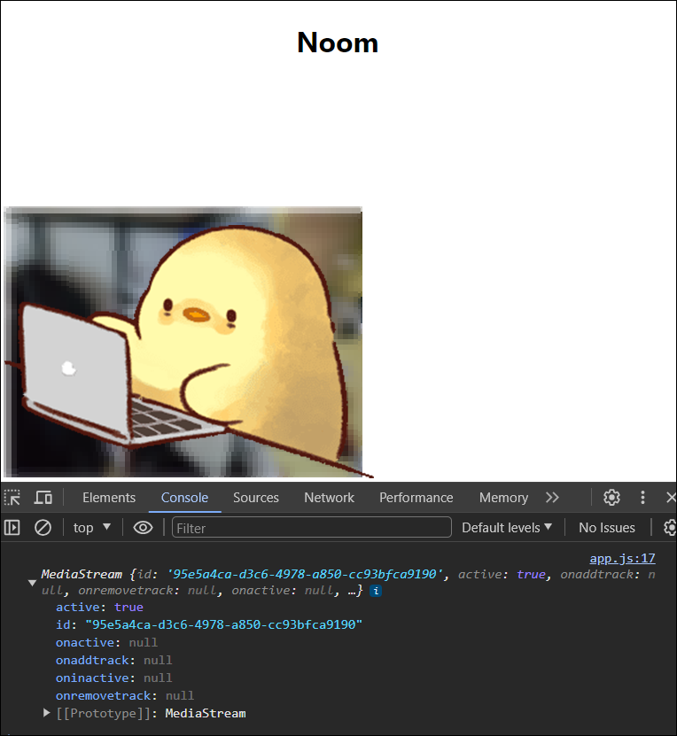

## 사용자로부터 비디오를 가져와 화면에 비디오 표출

### 1. 화면에 비디오 생성

- src > views > home.pug 에 video 생성
- video 속성
  - autoplay(자동재생)
  - playsinline(모바일 기기로 비디오 재생 전체화면으로 재생되는 것을 막아줌)

```javascript
doctype html
html(lang="en")
  head
    meta(charset="UTF-8")
    meta(name="viewport", content="width=device-width, initial-scale=1.0")
    title Noom
    link(rel="stylesheet", href="https://unpkg.com/mvp.css")
  body
    header
      h1 Noom
    main
      //- 카메라
      video#myFace(autoplay,playsinline, width="400", height="400")
    script(src="/socket.io/socket.io.js")
    script(src="/public/js/app.js")
```

### 2. 미디어 장치 정보 가져오기

> ### `navigator.mediaDevices.getUserMedia()`
>
> MediaDevices 인터페이스의 `getUserMedia()` 메서드는 사용자에게 미디어 입력 장치(마이크, 카메라 등) 사용 권한을 요청한다.  
> 요청이 수락되면 미디어 종류의 트랙(비디오 트랙, 오디오 트랙 등)을 포함한 MediaStream을 반환한다.  
> [ 공식문서 - getUserMedia( ) ](https://developer.mozilla.org/en-US/docs/Web/API/MediaDevices/getUserMedia#examples)  
> &nbsp;

- src > public > js > app.js 에 video의 srcObject속성에 `getUserMedia()`를 호출한 값을 넣어준다.

```javascript
const socket = io();

const myFace = document.getElementById("myFace");
// stream: 비디오 + 오디오
let myStream;

// 미디어 장치(audio, video) 출력
async function getMedia() {
  try {
    myStream = await navigator.mediaDevices.getUserMedia({
      audio: true,
      video: true,
    });
    console.log(myStream);
    myFace.srcObject = myStream;
  } catch (error) {
    console.log(error);
  }
}

getMedia();
```

### 미디어 장치 사용권한과 정보 콘솔에 출력

<p align="center">
  
  
</p>

## 마이크, 카메라 제어 버튼

### 1. 화면에 버튼 생성

- src > views > home.pug 에 button 2개 생성
- src > public > js > app.js에 button event 설정

```javascript
doctype html
html(lang="en")
  head
    meta(charset="UTF-8")
    meta(name="viewport", content="width=device-width, initial-scale=1.0")
    title Noom
    link(rel="stylesheet", href="https://unpkg.com/mvp.css")
  body
    header
      h1 Noom
    main
      div#myStream
        video#myFace(autoplay,playsinline, width="400", height="400")
        //- 소리 on/off 버튼
        button#mute Mute
        //- 카메라 on/off 버튼
        button#camera Camera Off
    script(src="/socket.io/socket.io.js")
    script(src="/public/js/app.js")
```

```javascript
const socket = io();

const myFace = document.getElementById("myFace");
const muteBtn = document.getElementById("mute");
const cameraBtn = document.getElementById("camera");

let myStream; // stream: 비디오 + 오디오
let muted = false; // 소리가 나는 상태
let cameraOff = false; // 카메라가 켜져있는 상태

// 미디어 장치(audio, video) 출력
async function getMedia() {
  try {
    myStream = await navigator.mediaDevices.getUserMedia({
      audio: true,
      video: true,
    });
    // console.log(myStream);
    myFace.srcObject = myStream;
  } catch (error) {
    console.log(error);
  }
}

getMedia();

// 음소거 버튼의 텍스트와 상태
function handleMuteClick() {
  if (!muted) {
    muteBtn.innerText = "Unmute";
    muted = true;
  } else {
    muteBtn.innerText = "Mute";
    muted = false;
  }
}

// 카메라 버튼의 텍스트와 상태
function handleCameraClick() {
  if (!cameraOff) {
    cameraBtn.innerText = "Camera On";
    cameraOff = true;
  } else {
    cameraBtn.innerText = "Camera Off";
    cameraOff = false;
  }
}

muteBtn.addEventListener("click", handleMuteClick);
cameraBtn.addEventListener("click", handleCameraClick);
```

### 2. 오디오, 비디오 정보 가져오기

> ### `getAudioTracks()`
>
> 오디오 정보 가져오기  
> [ 공식문서 - getAudioTracks( ) ](https://developer.mozilla.org/en-US/docs/Web/API/MediaStream/getAudioTracks)
>
> ### `getVideoTracks()`
>
> 비디오 정보 가져오기  
> [ 공식문서 - getVideoTracks( ) ](https://developer.mozilla.org/en-US/docs/Web/API/MediaStream/getVideoTracks)

### "Mute 버튼", "Camera Off 버튼" 클릭시 해당 정보 콘솔에 출력

<p align="center">
  
  
</p>

- src > public > js > app.js 에 `enabled` 상태로 소리와 카메라 on/off 기능 생성

```javascript
// 음소거 버튼의 텍스트와 상태
function handleMuteClick() {
  console.log(myStream.getAudioTracks());
  // 소리 on/off 기능
  myStream
    .getAudioTracks()
    .forEach((track) => (track.enabled = !track.enabled));
  if (!muted) {
    muteBtn.innerText = "Unmute";
    muted = true;
  } else {
    muteBtn.innerText = "Mute";
    muted = false;
  }
}

// 카메라 버튼의 텍스트와 상태
function handleCameraClick() {
  console.log(myStream.getVideoTracks());
  // 카메라 on/off 기능
  myStream
    .getVideoTracks()
    .forEach((track) => (track.enabled = !track.enabled));
  if (!cameraOff) {
    cameraBtn.innerText = "Camera On";
    cameraOff = true;
  } else {
    cameraBtn.innerText = "Camera Off";
    cameraOff = false;
  }
}
```

### "Mute 버튼", "Camera Off 버튼" 클릭시 음소거, 카메라 꺼짐


## 카메라 장치 변경

### 1. 사용 가능한 카메라 장치 나타내기

> ### `navigator.mediaDevices.enumerateDevices()`
>
> 현재 사용 가능한 미디어 입력 및 출력 장치 목록을 요청  
> [ 공식문서 - enumerateDevices( ) ](https://developer.mozilla.org/en-US/docs/Web/API/MediaDevices/enumerateDevices)

- src > public > js > app.js 에 사용 가능한 모든 장치 중에서도 videoInput(카메라)만 가져오기

```javascript
// 사용 가능한 카메라 장치 출력
async function getCameras() {
  try {
    // 사용 가능한 장치 목록
    const devices = await navigator.mediaDevices.enumerateDevices();
    console.log(devices);
    // 사용 가능한 장치 목록 중 카메라 목록만
    const cameras = devices.filter((devices) => devices.kind === "videoinput");
    console.log(cameras);
  } catch (error) {
    console.log(error);
  }
}

// 미디어 장치(audio, video) 출력
async function getMedia() {
  try {
    myStream = await navigator.mediaDevices.getUserMedia({
      audio: true,
      video: true,
    });
    // console.log(myStream);
    myFace.srcObject = myStream;
    // getCameras() 실행
    await getCameras();
  } catch (error) {
    console.log(error);
  }
}
```


### 2. 화면에 카메라 목록 생성

- src > views > home.pug 에 카메라 목록을 선택할 수 있는 `select` 생성

```javascript
doctype html
html(lang="en")
  head
    meta(charset="UTF-8")
    meta(name="viewport", content="width=device-width, initial-scale=1.0")
    title Noom
    link(rel="stylesheet", href="https://unpkg.com/mvp.css")
  body
    header
      h1 Noom
    main
      div#myStream
        video#myFace(autoplay,playsinline, width="400", height="400")
        button#mute Mute
        button#camera Camera Off
        //- 카메라 목록
        select#camears
    script(src="/socket.io/socket.io.js")
    script(src="/public/js/app.js")
```

- src > public > js > app.js 에 사용 가능한 카메라 목록 `option`에 추가

```javascript
const camerasSelect = document.getElementById("camears");

// 사용 가능한 카메라 장치 출력
async function getCameras() {
  try {
    // 사용 가능한 장치 목록
    const devices = await navigator.mediaDevices.enumerateDevices();
    // 사용 가능한 장치 목록 중 카메라 목록만
    const cameras = devices.filter((devices) => devices.kind === "videoinput");
    // 사용 가능한 카메라 목록 option에 추가
    cameras.forEach((camera) => {
      const option = document.createElement("option");
      option.value = camera.deviceId;
      option.innerText = camera.label;
      camerasSelect.appendChild(option);
    });
  } catch (error) {
    console.log(error);
  }
}
```


### 3. 목록에서 다른 카메라 선택시 카메라 변경

> `constrains` 매개변수에 담을 객체로 세부적인 요청을 할 수도 있다.  
> 예를 들어 비디오의 해상도를 특정해서 요청할수도 있고, 모바일 장치 전면, 후면 카메라를 특정해 요청할수도 있다.  
> `constrains`뿐 아니라 `deviceId`를 사용하면 특정 장치를 요청할 수 있다.


- 카메라 목록에서 특정 카메라를 선택하면 해당 카메라의 id(`deviceId`)를 getMedia( )에 전송
- 이전 코드에선 카메라 목록이 있기 전에 getMedia( )를 `deviceId`가 없이 호출했기 때문에 `deviceId` 존재 유/무에 따라 코드 변경
- 카메라 목록에 선택되어 있는 카메라와 표시되는 카메라가 불일치하다.  
  이를 고치기위해 현재 사용하고 있는 카메라와 선택된 카메라의 label이 같다면 카메라 목록에 선택되어 있는걸로 표출해주기

```javascript
const socket = io();

const myFace = document.getElementById("myFace");
const muteBtn = document.getElementById("mute");
const cameraBtn = document.getElementById("camera");
const camerasSelect = document.getElementById("camears");

let myStream; // stream: 비디오 + 오디오
let muted = false; // 소리가 나는 상태
let cameraOff = false; // 카메라가 켜져있는 상태

// 사용 가능한 카메라 장치 출력
async function getCameras() {
  try {
    // 사용 가능한 장치 목록
    const devices = await navigator.mediaDevices.enumerateDevices();
    // console.log(devices);
    // 사용 가능한 장치 목록 중 카메라 목록만
    const cameras = devices.filter((devices) => devices.kind === "videoinput");
    // console.log(cameras);
    // 현재 사용하고 있는 카메라
    const currentCamera = myStream.getVideoTracks()[0];
    // 사용 가능한 카메라 목록 option에 추가
    cameras.forEach((camera) => {
      const option = document.createElement("option");
      option.value = camera.deviceId;
      option.innerText = camera.label;
      // 사용하고 있는 카메라와 선택된 카메라의 label이 같다면 선택된걸로 출력
      if (currentCamera.label === camera.label) {
        option.selected = true;
      }
      camerasSelect.appendChild(option);
    });
  } catch (error) {
    console.log(error);
  }
}

// 미디어 장치(audio, video) 출력
async function getMedia(deviceId) {
  // initialConstraints : deviceId가 없을때 실행(카메라 목록 만들기 전)
  const initialConstraints = {
    audio: true,
    video: { facingMode: "user" },
  };
  // cameraConstraints : deviceId가 있을때 실행(카메라 목록 만든 후)
  const cameraConstraints = {
    audio: true,
    video: {
      deviceId: {
        exact: deviceId,
      },
    },
  };

  try {
    myStream = await navigator.mediaDevices.getUserMedia(
      // deviceId 가 있다면 cameraConstraints 없다면 initialConstraints
      deviceId ? cameraConstraints : initialConstraints
    );
    /*
    myStream = await navigator.mediaDevices.getUserMedia({
      audio: true,
      video: true,
    });
    */
   // console.log(myStream);
    myFace.srcObject = myStream;
    /*
    목록에서 카메라를 선택하면 카메라 목록이 늘어남
    "await getCameras();" 를 if문으로 감싸기
    처음 getMedia()를 실행했을때(!deviceId 인 경우)만 실행
    */
   if (!deviceId) {
     // getCameras() 실행
      await getCameras();
    }
  } catch (error) {
    console.log(error);
  }
}
getMedia();

...

// 선택한 카메라 getMedia() 로 전송
async function handleCameraChange() {
  // console.log(camerasSelect.value);
  await getMedia(camerasSelect.value);
}

muteBtn.addEventListener("click", handleMuteClick);
cameraBtn.addEventListener("click", handleCameraClick);
camerasSelect.addEventListener("input", handleCameraChange);
```


