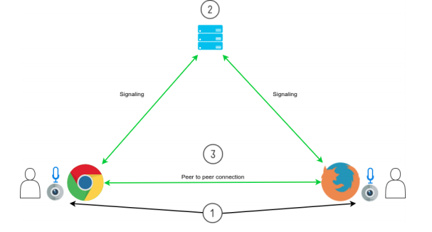
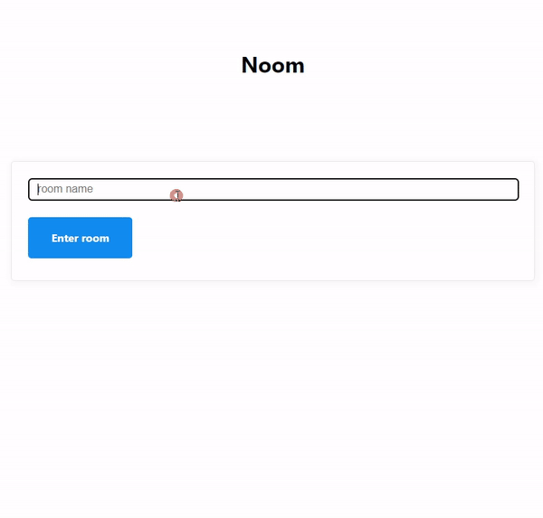
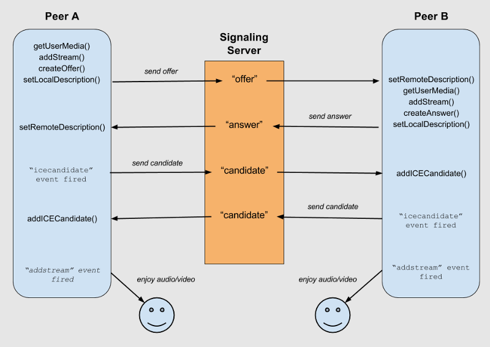
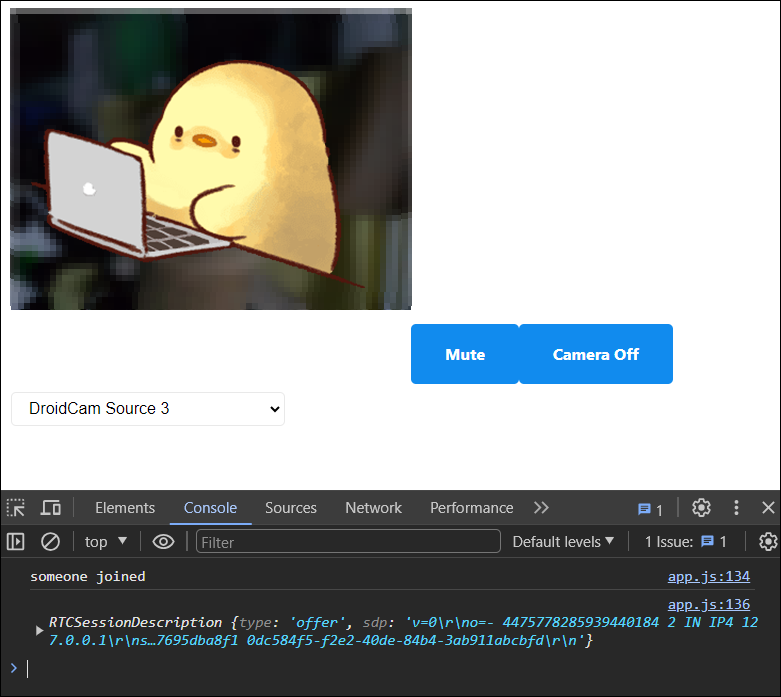
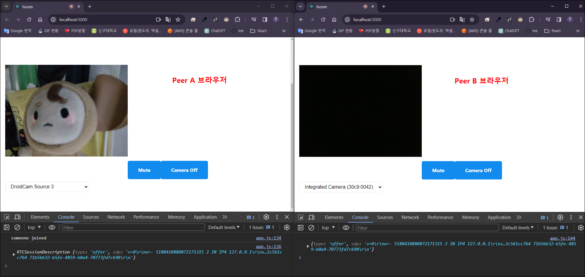
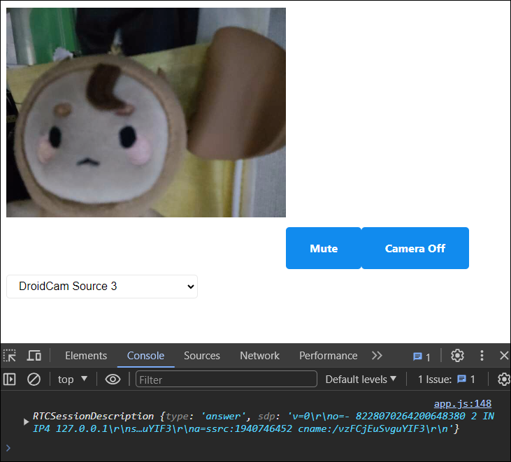
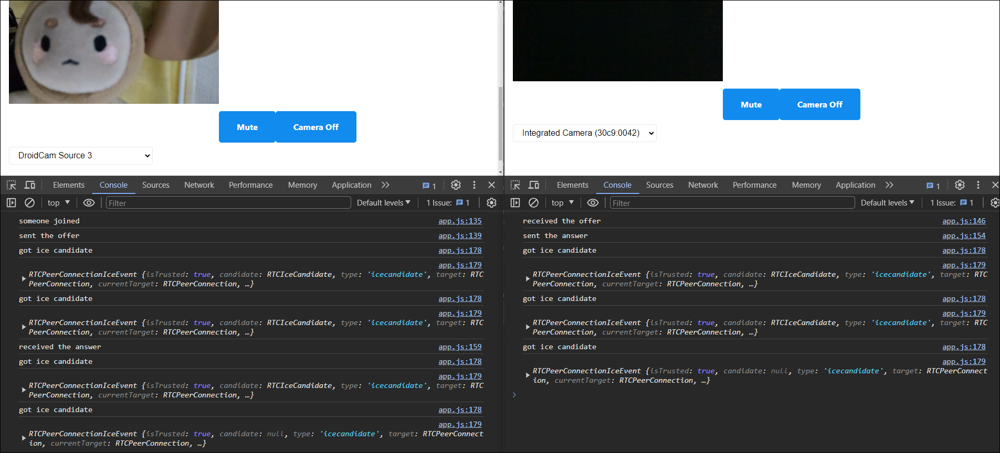
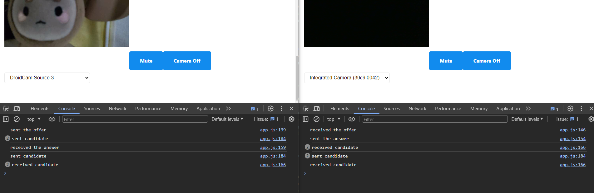
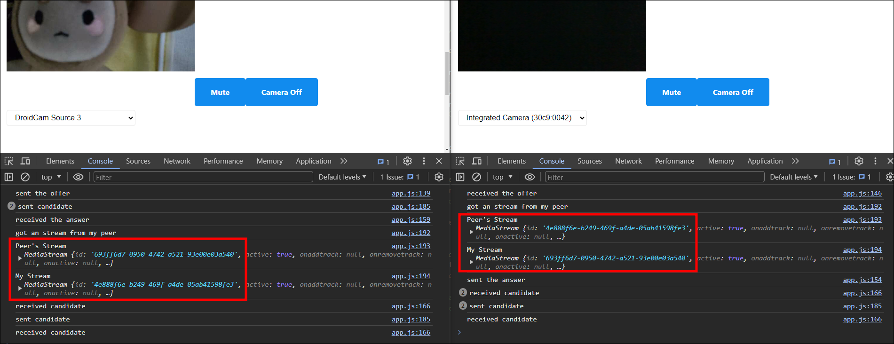
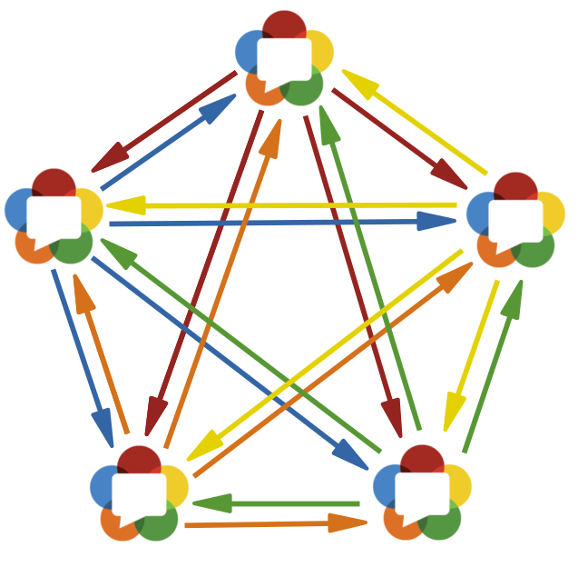

# WebRTC 소개

> ## WebRTC(Web Real-Time Communication)
>
> 실시간 커뮤니케이션을 가능하게 해주는 기술  
> [ 공식문서 - WebRTC API ](https://developer.mozilla.org/ko/docs/Web/API/WebRTC_API)
>
> 
>
> ### 1. Peer to Peer 형식으로 실시간 통신이 이루어진다.
>
> Peer to Peer는 서버를 통하지 않고, 나의 브라우저와 너의 브라우저가 바로 직통으로 연결되어 커뮤니케이션이 가능하다.  
>  ❗❗ "서버"가 중간에 끼지 않는 것이 바로 WebRTC ❗❗  
>  바로 직통으로 전송되기 때문에 실시간으로 속도가 엄청나게 빠른 것이 특징이다.
>
> ### 2. 서버는 signaling을 거들뿐!
>
> 브라우저 간 직통으로 연결되어 실시간 소통을 하기 위해서는 통신을 원하는 곳의 ip 주소가 필요한데,  
>  이때 브라우저는 서버한테 configuration(방화벽, 라우터 설정같은 것)을 전달한다. 그럼 서버가 연결하고자 하는 다른 브라우저에게 나의 위치를 알려준다.  
>  브라우저는 서로의 위치를 알고 나서야 연결이 가능하다.

# WebRTC 소통

### 1. Rooms

- src > views > home.pug 에 방이름 입력하는 폼과 버튼 생성
- src > public > js > app.js 에 방이름입력시 서버로 전송하고 미디어 출력하는 이벤트 기입
- src > server.js 에 클라이언트에서 보낸 event(방이름, startMedia()) 받아서 방 생성

```javascript
// home.pug
doctype html
html(lang="en")
  head
    meta(charset="UTF-8")
    meta(name="viewport", content="width=device-width, initial-scale=1.0")
    title Noom
    link(rel="stylesheet", href="https://unpkg.com/mvp.css")
  body
    header
      h1 Noom
    main
      div#welcome
        form
          input(placeholder="room name", required, type="text")
          button Enter room
      div#call
        div#myStream
          video#myFace(autoplay,playsinline, width="400", height="400")
          button#mute Mute
          button#camera Camera Off
          select#camears
    script(src="/socket.io/socket.io.js")
    script(src="/public/js/app.js")
```

```javascript
// app.js
...

const call = document.getElementById("call");
const welcome = document.getElementById("welcome");
const welcomeForm = welcome.querySelector("form");

// 방이름 폼 감추고 미디어 출력
function startMedia() {
  // 방이름 폼 숨기고, 비디오, 카메라와 오디오제어버튼, 카메라목록 보이게 하기
  welcome.hidden = true;
  call.hidden = false;
  // 비디오, 오디오 출력
  getMedia();
}

// 방이름을 서버로 전송
function handleWelcomeSubmit(e) {
  e.preventDefault();
  const input = welcomeForm.querySelector("input");
  // 서버로 "join_room" event 전송
  socket.emit("join_room", input.value, startMedia);
  input.value = "";
}

welcomeForm.addEventListener("submit", handleWelcomeSubmit);
```

```javascript
// server.js
import http from "http";
import SocketIO from "socket.io";
import express from "express";

const app = express();

app.set("view engine", "pug");
app.set("views", __dirname + "/views");
app.use("/public", express.static(__dirname + "/public"));
app.get("/", (_, res) => res.render("home"));
app.get("/*", (_, res) => res.redirect("/"));

const httpServer = http.createServer(app);
const wsServer = SocketIO(httpServer);

// socket.io 연결
wsServer.on("connection", (socket) => {
  // 클라이언트에서 보낸 "join_room" event 받기
  socket.on("join_room", (roomName, done) => {
    // input값으로 방 참가
    socket.join(roomName);
    done();
  });
});

const handleListen = () => console.log(`Listening on http://localhost:3000`);
httpServer.listen(3000, handleListen);
```



- src > public > js > app.js 에 방에 참가했을때 나중에 쓸 수 있도록 방 이름을 변수에 저장  
  이유 - 현재 있는 방의 이름을 알아야 하기 때문에 방 이름을 변수에 저장한다.

```javascript
const socket = io();

const myFace = document.getElementById("myFace");
const muteBtn = document.getElementById("mute");
const cameraBtn = document.getElementById("camera");
const camerasSelect = document.getElementById("camears");

const call = document.getElementById("call");

call.hidden = true;

let myStream;
let muted = false;
let cameraOff = false;
let roomName;

...

// 방이름을 서버로 전송
function handleWelcomeSubmit(e) {
  e.preventDefault();
  const input = welcomeForm.querySelector("input");
  // 서버로 "join_room" event 전송
  socket.emit("join_room", input.value, startMedia);
  roomName = input.value;
  input.value = "";
}

welcomeForm.addEventListener("submit", handleWelcomeSubmit);
```

- src > server.js 에서 "welcome" event 클라이언트에 전송
- src > public > js > app.js 에 서버에서 보낸 "welcome" event 받기

```javascript
// server.js
wsServer.on("connection", (socket) => {
  socket.on("join_room", (roomName, done) => {
    socket.join(roomName);
    done();
    // 방에 있는 모든 user에게 "welcome" event 전송
    socket.to(roomName).emit("welcome");
  });
});
```

```javascript
// app.js
socket.on("welcome", () => {
  console.log("someone joined");
});
```

### 2. 양쪽 브라우저에 RTC연결 생성, addStream() 생성



- 양쪽 브라우저에서 연결통로를 생성하기위해 src > public > js > app.js 에
  양쪽 브라우저에서 돌아가는 코드 `startMedia( )` 에 `makeConnection()`기입

```javascript
let myPeerConnection;

// 방이름 폼 감추고 미디어 출력
async function startMedia() {
  // 방이름 폼 숨기고, 비디오, 카메라와 오디오제어버튼, 카메라목록 보이게 하기
  welcome.hidden = true;
  call.hidden = false;
  // 비디오, 오디오 출력
  await getMedia();
  makeConnection();
}

...

// RTC Code //////////////////////////////////////////////////

function makeConnection() {
  // 양 브라우저 간 peer to peer 연결을 만듦
  myPeerConnection = new RTCPeerConnection();
  // console.log(myStream.getTracks()); // 사용하고 있는 오디오, 비디오 트랙 출력
  // 양쪽 브라우저에서 myStream.getTracks()으로 얻은 데이터(카메라와 마이크)를 myPeerConnection안에 집어넣음
  myStream
    .getTracks()
    .forEach((track) => myPeerConnection.addTrack(track, myStream));
}
```

### 3. Offers

> [ 공식문서 - create( ) ](https://developer.mozilla.org/en-US/docs/Web/API/RTCPeerConnection/createOffer)  
> [ 공식문서 - setLocalDescription( ) ](https://developer.mozilla.org/ko/docs/Web/API/RTCPeerConnection/setLocalDescription)

- Peer A 브라우저에서 `createOffer()` 생성, `offer`를 만들었다면 `setLocalDescription()`로 연결  
  ❗ Peer A 브라우저와 Peer B 브라우저 구분하는 방법 - `방에 참가하면 알림을 받는게 Peer A 브라우저`  
  ❗ `createOffer()`는 Peer B 브라우저가 방에 참가하면 Peer A 브라우저에서 실행되는 코드에서 발생한다.
- Peer B 브라우저에 `offer` 데이터를 보내주기 위해 서버에 "offer" event 전송

```javascript
// Socket Code //////////////////////////////////////////////////

// 서버에서 보낸 "welcome" event 받기(Peer A 브라우저에서만 실행)
socket.on("welcome", async () => {
  console.log("someone joined");
  const offer = await myPeerConnection.createOffer();
  console.log(offer);
  myPeerConnection.setLocalDescription(offer);
  // Peer B 브라우저에 offer 데이터를 보내기 위해 서버에 "offer" event 전송
  socket.emit("offer", offer, roomName);
});
```



- 클라이언트에서 보낸 `offer` 데이터를 방에 있는 모든 클라이언트에 `offer` 데이터를 전송

```javascript
wsServer.on("connection", (socket) => {
  socket.on("join_room", (roomName, done) => {
    socket.join(roomName);
    done();
    socket.to(roomName).emit("welcome");
  });

  // 클라이언트에서 보낸 "offer" event 받기
  socket.on("offer", (offer, roomName) => {
    // 발신자를 제외한 방에 있는 모든 클라이언트에게 "offer" event 전송
    socket.to(roomName).emit("offer", offer);
  });
});
```

- 서버에서 보낸 "offer" event 받기

```javascript
// 서버에서 보낸 "offer" event 받기(Peer B 브라우저에서만 실행)
socket.on("offer", (offer) => {
  console.log(offer);
});
```



### 4. Answers

> [ 공식문서 - setRemoteDescription( ) ](https://developer.mozilla.org/en-US/docs/Web/API/RTCPeerConnection/setRemoteDescription)  
> [ 공식문서 - createAnswer( ) ](https://developer.mozilla.org/ko/docs/Web/API/RTCPeerConnection/createAnswer)

- Peer B 브라우저는 `opper` 를 받아 `setRemoteDescription()` 한다.

```javascript
// 서버에서 보낸 "offer" event 받기(Peer B 브라우저에서만 실행)
socket.on("offer", (offer) => {
  // console.log(offer);
  myPeerConnection.setRemoteDescription(offer);
});
```

- 여기서 오류 발생

  

  이유 ❓  
   너무 빠르게 일어난 일이라 Peer B 브라우저에서 발현되지 않아 myPeerConnection이 아직 존재하지 않기때문이다.  
   해결 ✅  
   이전 코드에서는 startMedia함수를 실행할때 방에 참가하고 나서 호출하는데 방에 참가하기 전에 실행하는 걸로 수정한다.  
   수정 전엔 서버로 "join_room" event를 전송할때 startMedia함수를 같이 보냈으므로 서버에서도 지워준다.

```javascript
/* app.js */
// 수정 전
function handleWelcomeSubmit(e) {
  e.preventDefault();
  const input = welcomeForm.querySelector("input");
  // 방에 참가 후 실행
  socket.emit("join_room", input.value, startMedia);
  roomName = input.value;
  input.value = "";
}

// 수정 후
async function handleWelcomeSubmit(e) {
  e.preventDefault();
  const input = welcomeForm.querySelector("input");
  // 방에 참가하기전에 실행
  await startMedia();
  socket.emit("join_room", input.value);
  roomName = input.value;
  input.value = "";
}
```

```javascript
/* server.js */
wsServer.on("connection", (socket) => {
  socket.on("join_room", (roomName) => {
    socket.join(roomName);
    socket.to(roomName).emit("welcome");
  });

  socket.on("offer", (offer, roomName) => {
    socket.to(roomName).emit("offer", offer);
  });
});
```

- Peer B 브라우저에서 `createAnswer()` 생성, `answer`를 만들었다면 `setLocalDescription()`로 연결
- Peer A 브라우저에 `answer` 데이터를 보내기 위해 서버에 "answer" event 전송

```javascript
// 서버에서 보낸 "offer" event 받기(Peer B 브라우저에서만 실행)
socket.on("offer", async (offer) => {
  // console.log(offer);
  myPeerConnection.setRemoteDescription(offer);
  const answer = await myPeerConnection.createAnswer();
  console.log(answer);
  myPeerConnection.setLocalDescription(answer);
  // Peer A 브라우저에 answer 데이터를 보내기 위해 서버에 "answer" event 전송
  socket.emit("answer", answer);
});
```



- 클라이언트에서 보낸 `answer` 데이터를 방에 있는 모든 클라이언트에 `answer` 데이터를 전송

```javascript
wsServer.on("connection", (socket) => {
  socket.on("join_room", (roomName) => {
    socket.join(roomName);
    socket.to(roomName).emit("welcome");
  });

  socket.on("offer", (offer, roomName) => {
    socket.to(roomName).emit("offer", offer);
  });

  // 클라이언트에서 보낸 "answer" event 받기
  socket.on("answer", (answer, roomName) => {
    // 발신자를 제외한 방에 있는 모든 클라이언트에게 "answer" event 전송
    socket.to(roomName).emit("answer", answer);
  });
});
```

- 서버에서 보낸 "answer" event 받기
- Peer A 브라우저는 `answer` 를 받아 `setRemoteDescription()` 한다.  
  결국 두 브라우저는 모두 LocalDescription과 RemoteDescription을 가지게 된다.

```javascript
// 서버에서 보낸 "answer" event 받기(Peer A 브라우저에서만 실행)
socket.on("answer", (answer) => {
  console.log(answer);
  myPeerConnection.setRemoteDescription(answer);
});
```

> #### 요약
>
> 1단계 : 입장시 미디어 데이터를 불러옴[getUserMedia]  
> 2단계 : peerconnection 생성후 카메라,오디오 데이터를 peerconnection에 집어넣음[addStream]  
> 3단계 : A-B 연결시도시 A가 먼저 연결을 요청한 주체라고 볼수있음(예를들어 방에 먼저 들어온경우, 다른브라우저에게 초대장을보냄)[createOffer][setLocalDescription]  
> 4단계 : offer생성후 연결구성 그리고 offer를 peer B로 전송(socket.io이용)  
> 5단계 : B는 offer를 받고 setRemoteDescription을 설정하고 answer생성 [setRemoteDescription][createAnswer]  
> 6단계 : answer를 setLocalDescription을해서 A에게 전송 [setLocalDescription]  
> 7단계 : answer를 받은 A는 RemoteDescription을 가지게됨 그래서 RemoteDescription ,LocalDescription 둘다가지게됨

### 5. IceCandidate

> ### ICE Candidate
>
> 하나의 ICE candidate는 WebRTC가 원격 장치와 통신을 하기 위해 요구되는 프로토콜과 라우팅에 대해 알려줍니다.  
> ICE(Internet Connectivity Establishment, 인터넷 연결 생성) 는 webRTC의 프로토콜이며, 원격으로 다른 장치와 소통할 수 있게 해준다.
>
> [ 공식문서 - RTCIceCandidate ](https://developer.mozilla.org/ko/docs/Web/API/RTCIceCandidate)

### 🤔 어렵다,,,

WebRTC 에서 peer to peer 연결이 시작되면 여러가지 candidate 들이 나타나게 된다.  
여기서 candidate는 브라우저가 통신하는 방식에 대한 정보를 나타낸다고 생각했다.  
이 정보들을 원격 브라우저에 보내서 로컬과 원격 유저의 연결이 어떤 것이 가장 최적화된 것이라고 동의하기전까지 걔속해서 연결을 시도한다고 한다.

그러니까 ICE는 브라우저가 어떤 소통 방법이 제일 좋은지 제안하며 연결해주는 프로세스이다.  
다수의 후보(candidates)들을 제외하고 서로의 동의하에 하나를 선택한다!!!

- myPeerConnection을 만들면 IceCandidate event 등록

```javascript
// RTC Code //////////////////////////////////////////////////

function makeConnection() {
  myPeerConnection = new RTCPeerConnection();
  myPeerConnection.addEventListener("icecandidate", handleIce);
  myStream
    .getTracks()
    .forEach((track) => myPeerConnection.addTrack(track, myStream));
}

function handleIce(data) {
  console.log("got ice candidate");
  console.log(data);
}
```



- 두 브라우저가 candidate들을 서로 주고 받기

```javascript
/* app.js */

// 서버에서 보낸 "ice" event 받고 추가하기
socket.on("ice", (ice) => {
  console.log("received candidate");
  myPeerConnection.addIceCandidate(ice);
});

function makeConnection() {
  myPeerConnection = new RTCPeerConnection();
  myPeerConnection.addEventListener("icecandidate", handleIce);
  myStream
    .getTracks()
    .forEach((track) => myPeerConnection.addTrack(track, myStream));
}

function handleIce(data) {
  console.log("sent candidate");
  // 서버에 "ice" event 전송
  socket.emit("ice", data.candidate, roomName);
}
```

```javascript
/* server.js */

wsServer.on("connection", (socket) => {
  socket.on("join_room", (roomName) => {
    socket.join(roomName);
    socket.to(roomName).emit("welcome");
  });

  socket.on("offer", (offer, roomName) => {
    socket.to(roomName).emit("offer", offer);
  });

  socket.on("answer", (answer, roomName) => {
    socket.to(roomName).emit("answer", answer);
  });

  // 클라이언트에서 보낸 "ice" event 받기
  socket.on("ice", (ice, roomName) => {
    // 발신자를 제외한 방에 있는 모든 클라이언트에게 "ice" event 전송
    socket.to(roomName).emit("ice", ice);
  });
});
```



- addstream event 등록

```javascript
function makeConnection() {
  myPeerConnection = new RTCPeerConnection();
  myPeerConnection.addEventListener("icecandidate", handleIce);
  myPeerConnection.addEventListener("addstream", handleAddStream);
  myStream
    .getTracks()
    .forEach((track) => myPeerConnection.addTrack(track, myStream));
}
...

function handleAddStream(data) {
  console.log("got an event from my peer");
  console.log(data);
}
```



- 화면에 다른 비디오를 생성하고 위에서 받은 Stream으로 비디오 세팅

```javascript
// home.pug
doctype html
html(lang="en")
  head
    meta(charset="UTF-8")
    meta(name="viewport", content="width=device-width, initial-scale=1.0")
    title Noom
    link(rel="stylesheet", href="https://unpkg.com/mvp.css")
  body
    header
      h1 Noom
    main
      div#welcome
        form
          input(placeholder="room name", required, type="text")
          button Enter room
      div#call
        div#myStream
          video#myFace(autoplay,playsinline, width="400", height="400")
          button#mute Mute
          button#camera Camera Off
          select#camears
          video#peersFace(autoplay,playsinline, width="400", height="400")
    script(src="/socket.io/socket.io.js")
    script(src="/public/js/app.js")
```

```javascript
// app.js
function handleAddStream(data) {
  console.log("got an stream from my peer");
  console.log("Peer's Stream", data.stream);
  console.log("<y> Stream", myStream);
  const peersFace = document.getElementById("peersFace");
  peersFace.srcObject = data.stream;
}
```

<p align="center">
  
</p>

# Senders

### 🚨 문제발생

카메라 목록에서 카메라를 변경하면 Peer Stream에 반영이 안되는 문제 발생

### ✅ 해결방법

카메라를 바꿀때마다 서로 다른 id로 새로운 stream을 만든다.  
해야할 일은 peer한테 줄 stream을 업데이트해야한다.  
왜냐하면 `makeConnection()` 에서 peer-to-peer 연결을 만들때 해당 peer에 track을 추가하기 때문이다.  
추가한 track을 변경해야된다.

> ### `getSender()`
>
> 카메라 종류를 바꾸거나 음소거하거나 등의 미디어를 바꿀 때가 있다.  
> Sender는 다른 브라우저로 이미 보낸 media stream track을 컨트롤할 수 있게 만들어준다.  
> 그럼 로컬 브라우저에서 원격으로 비디오나 오디오에 대한 변경을 실시간으로 반영할 수 있다.  
> [ 공식문서 - `getSender( )`](https://developer.mozilla.org/en-US/docs/Web/API/RTCRtpSender)  
> &nbsp;

- `myPeerConnection`이 존재하면 kind: "video"를 가진 Sender를 찾아서 `getSenders()` 실행
- webRTC로 소통할때 비디오나 오디오 트랙을 변경할때 실시간으로 데이터를 전달해주기 위해서는 `RTCRtpSender.replaceTrack()` 메소드를 사용

```javascript
async function handleCameraChange() {
  await getMedia(camerasSelect.value);
  if (myPeerConnection) {
    // webRTC 발생 후 선택한 새 장치로 새로 업데이트 된 video track을 받음
    const videoTrack = myStream.getVideoTracks()[0];
    const videoSender = myPeerConnection
      .getSenders()
      .find((sender) => sender.track.kind === "video");
    console.log(videoSender);
    videoSender.replaceTrack(videoTrack);
  }
}
```

<p align="center">
  
</p>

---

### 🚨 문제발생

웹사이트를 폰으로 접속하면 작동하지 않는다.

### ✅ 해결방법

`local tunnel` 로 서버의 URL을 생성할 수 있다.  
`local tunnel` 은 서버를 전세계와 공유하게 해준다.

> #### local tunnel 설치 : `npm i -g localtunnel `
>
> `lt` 를 사용해서 local tunnel을 호출하면 사용가능한 커맨드 출력
>
> #### `lt --port 3000` 으로 URL 생성
>
> &nbsp;

<p align="center">
  
</p>

# STUN

### 🚨 문제발생

컴퓨터와 폰이 같은 WiFi에 있지 않으면 같은 방에 참가해도 서로의 비디오가 보이지 않는다.

### ✅ 해결방법

`STUN 서버` 사용

> ### `STUN 서버`
>
> 컴퓨터가 공용 IP주소를 찾게 해준다.  
> 네트워크에서 데이터를 주고받기 위해서는 공용 퍼블릭 IP가 필요하다.
> peer to peer 방식으로 작동하는 webRTC는 모든 기기의 환경이 다르기 때문에 단순하게 연결되지 않는다.  
> 그렇기 때문에 STUN서버로 좀 더 완전하게 동작할 수 있도록 만들어줘야 한다.
>
> [ 공식문서 - STUN ](https://help.singlecomm.com/hc/en-us/articles/115007993947-STUN-servers-A-Quick-Start-Guide)  
> &nbsp;

- 사용하고자 하는 `STUN 서버`의 리스트 추가(구글에서 제공하는 서버 리스트 사용)  
  ❗ 실제 서비스에 적용하는 것은 무리가 있다. 그때는 직접 STUN 서버를 만들어야 한다.

```javascript
/* app.js */
function makeConnection() {
  // 양 브라우저 간 peer to peer 연결을 만듦
  myPeerConnection = new RTCPeerConnection({
    iceServers: [
      {
        urls: [
          "stun:stun.l.google.com:19302",
          "stun:stun1.l.google.com:19302",
          "stun:stun2.l.google.com:19302",
          "stun:stun3.l.google.com:19302",
          "stun:stun4.l.google.com:19302",
        ],
      },
    ],
  });
  // console.log(myStream.getTracks()); // 사용하고 있는 오디오, 비디오 트랙 출력
  myPeerConnection.addEventListener("icecandidate", handleIce);
  myPeerConnection.addEventListener("addstream", handleAddStream);
  // 양쪽 브라우저에서 myStream.getTracks()으로 얻은 데이터(카메라와 마이크)를 myPeerConnection안에 집어넣음
  myStream
    .getTracks()
    .forEach((track) => myPeerConnection.addTrack(track, myStream));
}
```

# WebRTC의 단점

### 너무 많은 Peer을 가지고 있을때 굉장히 느려진다.



Peer이 많아지기 시작하면 실시간 소통이 굉장히 느려지기 시작할 것이다.  
만약 5개의 peer 브라우저가 있다고 했을 때, A브라우저가 비디오 정보를 보낸다면, B, C, D, E 브라우저에 각각 보내야 하기 때문이다.  
같은 비디오 스트림을 4번 실행해야 하는 것이다.(그물망 방식)  
모든 사람들이 직접적으로 연결되어 있기 때문이다.
최대 3개까지하는 것이 좋을 것 같다.
